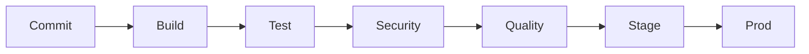

# CI/CD Guide

This document outlines the continuous integration and continuous deployment processes for the Event Manager system.

## Table of Contents

- [CI/CD Overview](#cicd-overview)
- [Pipeline Configuration](#pipeline-configuration)
- [Build Process](#build-process)
- [Testing Strategy](#testing-strategy)
- [Deployment Stages](#deployment-stages)
- [Quality Gates](#quality-gates)
- [Security Scanning](#security-scanning)
- [Monitoring & Alerts](#monitoring--alerts)
- [Release Management](#release-management)
- [Rollback Procedures](#rollback-procedures)

## CI/CD Overview

### Pipeline Architecture

```yaml
pipeline_architecture:
  stages:
    - code_checkout
    - dependency_check
    - build
    - test
    - security_scan
    - quality_check
    - deploy_staging
    - integration_test
    - deploy_production
    - post_deployment
```

### Workflow Strategy



## Pipeline Configuration

### GitHub Actions

```yaml
# .github/workflows/main.yml
name: CI/CD Pipeline

on:
  push:
    branches: [ main, develop ]
  pull_request:
    branches: [ main, develop ]

jobs:
  build:
    runs-on: ubuntu-latest
    steps:
      - uses: actions/checkout@v2
      
      - name: Setup Node.js
        uses: actions/setup-node@v2
        with:
          node-version: '16'
          
      - name: Install Dependencies
        run: npm ci
        
      - name: Build
        run: npm run build
        
      - name: Test
        run: npm test
        
      - name: Security Scan
        run: npm run security-scan
```

### Jenkins Pipeline

```groovy
// Jenkinsfile
pipeline {
    agent any
    
    environment {
        NODE_ENV = 'production'
        DOCKER_REGISTRY = 'registry.example.com'
    }
    
    stages {
        stage('Checkout') {
            steps {
                checkout scm
            }
        }
        
        stage('Build') {
            steps {
                sh './scripts/ci-cd.sh build'
            }
        }
        
        stage('Test') {
            parallel {
                stage('Unit Tests') {
                    steps {
                        sh 'npm run test:unit'
                    }
                }
                stage('Integration Tests') {
                    steps {
                        sh 'npm run test:integration'
                    }
                }
            }
        }
    }
}
```

## Build Process

### Build Configuration

```javascript
// Build configuration
const buildConfig = {
  // Build environments
  environments: {
    development: {
      optimization: false,
      sourceMap: true,
      minify: false
    },
    production: {
      optimization: true,
      sourceMap: false,
      minify: true
    }
  },
  
  // Build steps
  steps: {
    clean: 'rm -rf dist',
    compile: 'tsc',
    bundle: 'webpack',
    docker: 'docker build'
  }
};
```

### Artifact Management

```yaml
# Artifact configuration
artifacts:
  storage:
    provider: 's3'
    bucket: 'artifacts'
    
  retention:
    policy: 'keep-last-5'
    
  versioning:
    format: '${BUILD_NUMBER}-${GIT_COMMIT}'
```

## Testing Strategy

### Test Execution

```javascript
// Test execution configuration
const testConfig = {
  // Test suites
  suites: {
    unit: {
      runner: 'jest',
      coverage: true,
      threshold: 80
    },
    integration: {
      runner: 'cypress',
      video: true,
      parallel: true
    }
  },
  
  // Test reporting
  reporting: {
    format: 'junit',
    output: 'test-results'
  }
};
```

### Quality Gates

```yaml
# Quality gate configuration
quality_gates:
  coverage:
    minimum: 80%
    
  tests:
    pass_rate: 100%
    
  code_quality:
    complexity: 10
    duplication: 3%
```

## Deployment Stages

### Staging Deployment

```javascript
// Staging deployment configuration
const stagingDeploy = {
  // Environment configuration
  environment: {
    name: 'staging',
    url: 'https://staging.example.com',
    variables: {
      NODE_ENV: 'staging',
      API_URL: 'https://api-staging.example.com'
    }
  },
  
  // Deployment steps
  steps: {
    preDeployment: async () => {
      await runMigrations();
      await backupDatabase();
    },
    
    deployment: async () => {
      await deployContainers();
      await updateConfigs();
    },
    
    postDeployment: async () => {
      await runHealthChecks();
      await notifyTeam();
    }
  }
};
```

### Production Deployment

```javascript
// Production deployment configuration
const productionDeploy = {
  // Deployment strategy
  strategy: {
    type: 'blue-green',
    healthCheck: true,
    rollback: true
  },
  
  // Load balancer configuration
  loadBalancer: {
    type: 'nginx',
    rules: [
      { path: '/api', service: 'api-service' },
      { path: '/', service: 'frontend-service' }
    ]
  }
};
```

## Quality Gates

### Code Quality

```javascript
// Code quality configuration
const codeQuality = {
  // Linting rules
  linting: {
    eslint: {
      extends: ['airbnb-base'],
      rules: {
        'max-len': ['error', 100],
        'no-console': 'error'
      }
    }
  },
  
  // Code coverage
  coverage: {
    global: {
      statements: 80,
      branches: 80,
      functions: 80,
      lines: 80
    }
  }
};
```

### Performance Gates

```yaml
# Performance thresholds
performance_gates:
  response_time:
    p95: 200ms
    p99: 500ms
    
  throughput:
    min: 1000rps
    
  error_rate:
    max: 0.1%
```

## Security Scanning

### Security Checks

```javascript
// Security scanning configuration
const securityScan = {
  // Vulnerability scanning
  vulnerabilities: {
    npm: 'npm audit',
    docker: 'trivy',
    code: 'snyk'
  },
  
  // Compliance checking
  compliance: {
    standards: ['PCI-DSS', 'GDPR'],
    tools: ['checkov', 'terraform-compliance']
  }
};
```

### Security Gates

```yaml
# Security gates
security_gates:
  vulnerabilities:
    critical: 0
    high: 0
    medium: review
    
  compliance:
    required_pass: 100%
```

## Monitoring & Alerts

### Pipeline Monitoring

```javascript
// Pipeline monitoring configuration
const pipelineMonitoring = {
  // Metrics collection
  metrics: {
    build_time: true,
    test_coverage: true,
    deployment_time: true,
    success_rate: true
  },
  
  // Alert configuration
  alerts: {
    pipeline_failure: {
      channels: ['slack', 'email'],
      threshold: 1
    },
    deployment_delay: {
      channels: ['slack'],
      threshold: '30m'
    }
  }
};
```

### Health Checks

```yaml
# Health check configuration
health_checks:
  endpoints:
    - /health
    - /readiness
    
  thresholds:
    response_time: 200ms
    success_rate: 99.9%
```

## Release Management

### Version Control

```javascript
// Version control configuration
const versionControl = {
  // Branching strategy
  branching: {
    main: 'main',
    develop: 'develop',
    feature: 'feature/*',
    release: 'release/*'
  },
  
  // Version management
  versioning: {
    major: 'breaking changes',
    minor: 'new features',
    patch: 'bug fixes'
  }
};
```

### Release Process

```yaml
# Release process
release_process:
  steps:
    - version_bump
    - changelog_update
    - tag_creation
    - artifact_creation
    - deployment
    - smoke_test
```

## Rollback Procedures

### Automated Rollback

```javascript
// Rollback configuration
const rollbackConfig = {
  // Triggers
  triggers: {
    error_rate: 1,
    response_time: 500,
    health_check: false
  },
  
  // Procedures
  procedures: {
    revert_deployment: true,
    restore_database: true,
    notify_team: true
  }
};
```

### Manual Rollback

```bash
# Rollback commands
./scripts/ci-cd.sh rollback <version>

# Rollback steps:
1. Stop current deployment
2. Restore previous version
3. Run health checks
4. Update DNS/Load Balancer
```

## Resources

- [CI/CD Best Practices](./docs/cicd-best-practices.md)
- [Pipeline Configuration Guide](./docs/pipeline-configuration.md)
- [Deployment Guide](./docs/deployment-guide.md)
- [Rollback Procedures](./docs/rollback-procedures.md)
